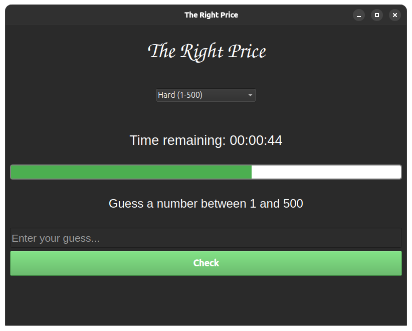

## The Right Price


[](https://GitHub.com/Naereen/StrapDown.js/graphs/commit-activity)

This game was inspired by the French game show "Le Juste Prix", in English The Right Price. Being a big fan of this game, I had fun creating a simple version in Python. You have 1min to find the exact price! 



## Requirements

uv (https://docs.astral.sh/uv/)

Python 3.12 (https://www.python.org/downloads/)

Tkinter (https://docs.python.org/3.13/library/tkinter.html)


## Usage

``` git clone https://github.com/Kami-404/The-Right-Price.git ```

``` cd The-Right-Price ```

``` uv init --python 3.12 ```

``` uv venv ```

``` uv run src/main.py ```

## Thank you for using this project!

I simply made this project for fun. I hope you found it useful and that it meets your needs.